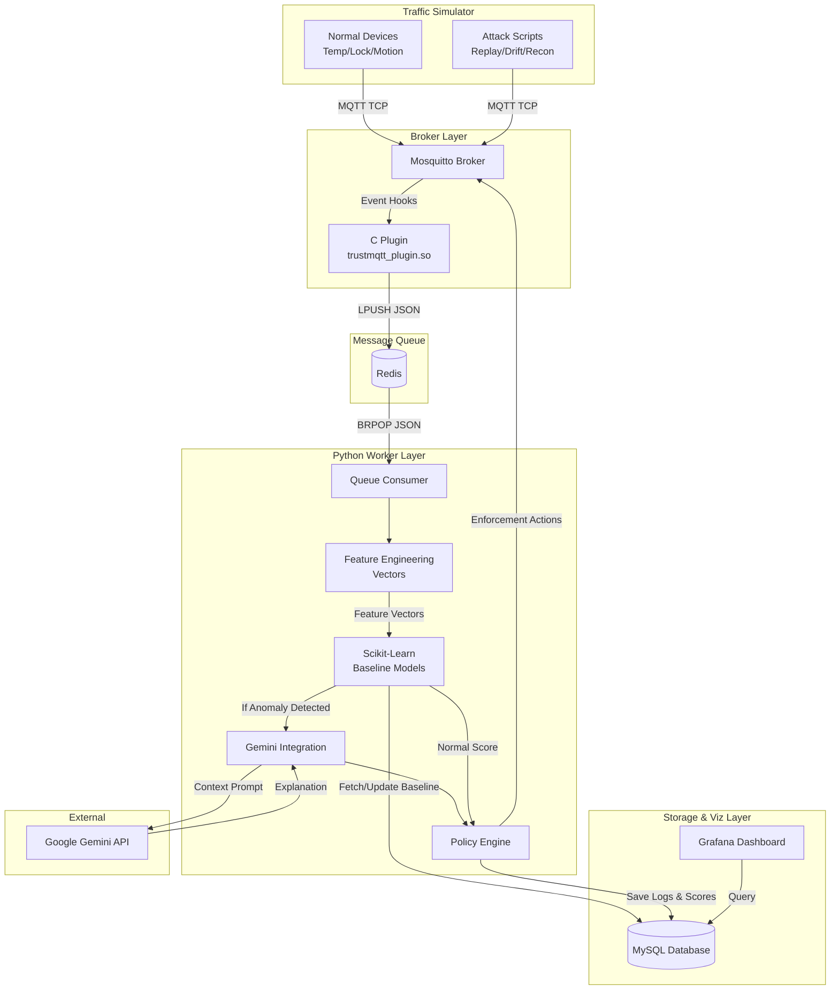
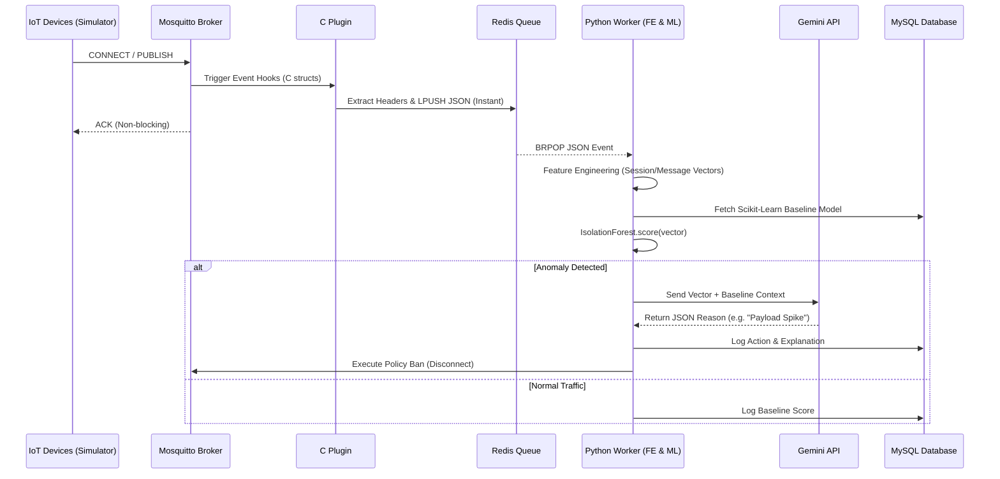

# TrustMQTT System Architecture

Here is the complete architectural layout of how the components we have built (and are building) interact to create a continuous behavioral identity verification system.

## High-Level Component Flow

This diagram illustrates the physical layers of the application and how data moves from the simulated IoT edge, through the C plugin, into the Python worker, and finally out to the database and dashboard.

## Execution Sequence

This sequence diagram illustrates exactly what happens when an MQTT message arrives, demonstrating how the system remains non-blocking at the broker level while performing heavy machine learning tasks asynchronously.

## Component Roles

1. **Traffic Simulator**: Feeds authentic, multi-threaded traffic into the broker. It generates clean data to train the baseline, and malicious data to test the anomaly detection.
2. **Mosquitto & C Plugin**: Sits at the network edge. It intercepts raw MQTT headers in microseconds using C, and pushes them to Redis so the broker doesn't freeze.
3. **Queue Consumer**: A Python script continuously polling Redis. It catches the JSON and routes it.
4. **Feature Engineering**: Converts raw MQTT events into numerical arrays (e.g., QoS 1 becomes `1.0`).
5. **Scikit-Learn (The Math)**: Mathematically compares the current numerical array against the historical baseline to generate a strict anomaly score (0.0 to 1.0).
6. **Gemini API (The Analyst)**: If the mathematical score is too high, Gemini acts as a human analyst to explain *why* the numbers changed.
7. **MySQL & Grafana**: Persists the baseline data and visualizes the attack logs.
